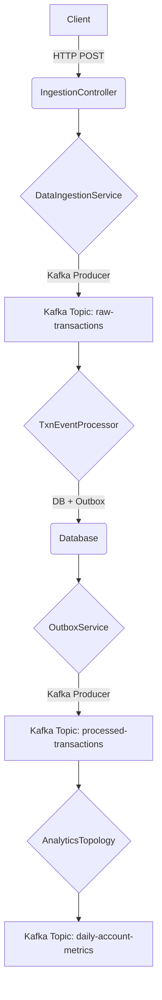

# Architecture Overview

This document provides a high-level overview of the `spring-kafka-poc` application architecture.

## Core Components

The application is a full-stack data pipeline with four main layers:

1.  **Ingestion (REST API):** A Spring Boot REST controller that accepts financial transactions.
2.  **Messaging (Kafka):** A Kafka cluster that acts as the durable, scalable backbone of the pipeline.
3.  **Processing (Kafka Streams & Spring Kafka):** A combination of Kafka Streams for real-time analytics and Spring Kafka consumers for database persistence.
4.  **Persistence (Spanner/AlloyDB/H2):** A multi-backend persistence layer with a dynamic router for resilience.

## Data Flow

## Key Architectural Patterns

*   **Transactional Outbox:** Ensures atomicity between database writes and Kafka message production.
*   **Resilient Consumer:** Uses `@RetryableTopic` for declarative, non-blocking retries with exponential backoff.
*   **Interactive Queries:** Exposes Kafka Streams state stores via a REST API for real-time analytics.
*   **Hexagonal Architecture:** Decouples business logic from persistence details with a `TransactionPersistencePort`.
*   **Dynamic Persistence Router:** Provides seamless fallback from Spanner/AlloyDB to H2 using a circuit breaker.
*   **Distributed Locking:** Ensures that the outbox poller runs on only one instance in a clustered environment.
*   **Cloud-Native Ready:** Includes configuration and deployment artifacts for GKE.
