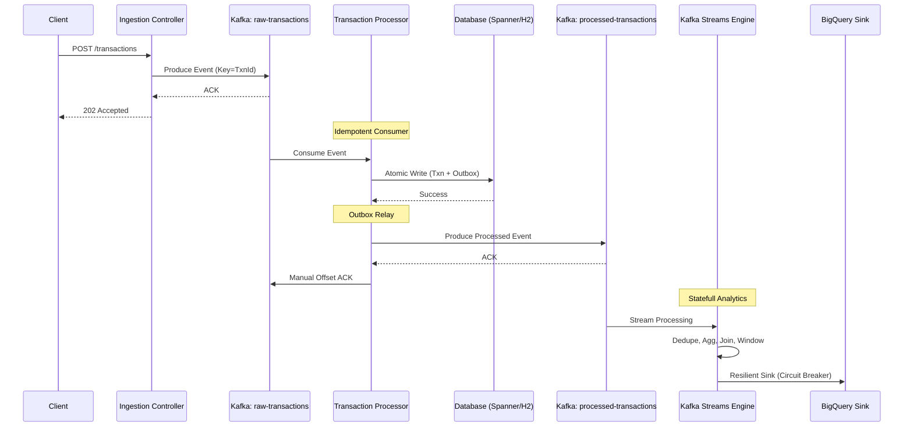

# 🏗️ Architecture Masterclass: The Bulletproof Pipeline

This document provides a deep-dive into the architectural decisions that make `spring-kafka-poc` a production-grade system capable of handling 50k+ events/second with financial integrity.

---

## 🏛️ 1. Hexagonal Architecture (Ports & Adapters)

The project is structured according to **Hexagonal Architecture** principles. The core business logic (the "Hexagon") is shielded from infrastructure details (Kafka, Spanner, BigQuery).

*   **The Domain:** Contained in `com.example.springkafkapoc.domain.model`. Pure POJOs without framework annotations.
*   **The Ports:** Interfaces like `TransactionPersistencePort` that define *what* the system needs.
*   **The Adapters:** Implementations like `SpannerTransactionService` and `H2TransactionService` that handle the *how* for specific technologies.

**The Benefit:** We can swap from a local H2 database to a globally distributed Cloud Spanner instance by changing a single property (`app.database.spanner-enabled`), without touching the business logic.

---

## 📡 2. High-Level Data Flow

The following diagram illustrates the "Golden Path" of a transaction through the system:

---

## 🛡️ 3. Key Reliability Patterns

### 🔹 Transactional Outbox
To avoid the "Dual Write" problem (where the DB write succeeds but the Kafka publish fails), we use an **Outbox**. The processor writes the transaction AND an outbox record to the database in a single atomic transaction. A separate poller (using distributed locks) then relays these records to Kafka.

### 🔹 Exactly-Once Semantics (EOS V2)
We utilize Kafka's `exactly_once_v2` processing guarantee. This ensures that even if a stream thread crashes and restarts, the internal state (aggregations) and the output topics are never corrupted by double-counting or missing data.

### 🔹 Deduplication at the Edge
The `SourceTopology` implements a stateful **Deduplication Processor**. It remembers transaction IDs for 24 hours. If a producer retries an old message, the stream engine drops it immediately before it can affect balances or metrics.

### 🔹 Non-Blocking Retries (Retryable Topics)
Unlike standard Kafka retries which block the partition, we use Spring's `@RetryableTopic`. Failed messages are moved to a "Retry Topic" with an exponential backoff delay, allowing the main consumer to keep processing healthy records.

---

## 🔗 4. Observability Stack

We implement "The Golden Thread" of traceability:
1.  **Correlation ID** is generated at the REST boundary.
2.  Propagated via **Kafka Headers**.
3.  Extracted in the **Consumer Thread**.
4.  Injected into **Audit Logs**.

This allows an engineer to search for a single UUID in a log aggregator (like Splunk or Cloud Logging) and see the entire lifecycle of a transaction across multiple microservices and topics.

---

*“Robustness is not an accident; it is the result of deliberate architectural choices.”*
