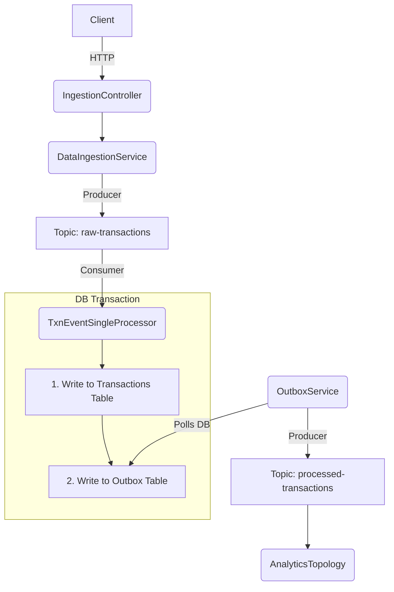

# The Peaky Blinders' Guide to the `spring-kafka-poc`

You're part of the family now. Don't mess it up. This is your guide. Read it. Learn it. Live it. This document contains the rules, the patterns, and the hard-won knowledge that keeps this operation running smoothly.

---

## 1. The Five Rules of the House

These are non-negotiable. Break them and you're out.

1.  **Fail Fast, Fail Loud.**
    -   **What:** Validate all incoming data at the HTTP boundary (`IngestionController`).
    -   **Why:** Bad data is poison. If a request has a null amount or a blank account ID, reject it immediately with a `400 Bad Request`. Don't let it get into Kafka and cause problems downstream.

2.  **Money is Exact.**
    -   **What:** Use `java.math.BigDecimal` for all financial values.
    -   **Why:** `Double` and `float` are for amateurs. They have rounding errors (`0.1 + 0.2 != 0.3`). In our business, precision is everything. We don't lose pennies.

3.  **The Database is the Source of Truth.**
    -   **What:** Write to your database *before* you try to send a message. Use the Transactional Outbox pattern.
    -   **Why:** If you send to Kafka first and then the database write fails, you've lied to the world. By writing to an `Outbox` table in the same transaction as your business data, you guarantee that the message will get out, even if the app crashes.

4.  **Don't Trust the Network.**
    -   **What:** Use Circuit Breakers (`Resilience4j`) and automated Retries (`@RetryableTopic`).
    -   **Why:** The network will fail. Databases will go down. Our system must not break when they do. The circuit breaker protects us from cascading failures, and the retry mechanism ensures transient errors are handled without manual intervention.

5.  **Know Your Environment.**
    -   **What:** Use Spring Profiles (`local`, `batch`, `gke`).
    -   **Why:** Code that runs on your machine is not the same as code that runs in production. A data loader (`SampleDataLoader`) must *never* run in production. Guard it with `@Profile("local")`.

---

## 2. Kafka: The Messaging Operation

This is the backbone of our entire operation. Treat it with respect.

### Mental Model: The Flow of a Transaction

### Producers
-   **Idempotence is Law:** `enable.idempotence=true` in `application.yml`. This prevents duplicate messages from a producer retry. No excuses.
-   **The Outbox is Your Weapon:** Don't call `kafkaTemplate.send()` directly from business logic. Write to the `Outbox` table. A separate, locked poller will handle the sending.

### Consumers
-   **`@RetryableTopic` is the Standard:** Don't write your own retry loops. Use this annotation. It's clean, declarative, and handles exponential backoff, jitter, and the Dead Letter Topic (DLT) for you.
-   **Respect the DLT:** Every `@RetryableTopic` needs a `@DltHandler` method. A message in the DLT is a five-alarm fire. It means a message has failed all retries and requires manual investigation. Your handler must log it, alert on it, and save it for forensics.
-   **Batch vs. Single:** Use `@Profile("batch")` for high-throughput scenarios (e.g., nightly settlements). Use a single-record listener (`@Profile("!batch")`) for low-latency, real-time processing.

### Kafka Streams
-   **State is Local (RocksDB):** Your stream's state (aggregations, tables) is stored locally in RocksDB. It's fast because it's not on the network.
-   **Query Your State:** Use Interactive Queries (`AnalyticsQueryService`) to expose the state store via a REST API. This turns your stream processor into a real-time analytics database.
-   **`selectKey` before `groupByKey`:** This is fundamental. To group records, you must first re-key the stream by the grouping attribute. This triggers a repartition so all records for the same key land on the same machine.

---

## 3. The Ledger: Database & Transactions

Our books must always be balanced.

### The Outbox Pattern
-   **The Problem:** How do you guarantee a Kafka message is sent if and only if a database transaction commits?
-   **The Solution:**
    1.  `BEGIN` a database transaction.
    2.  Inside your service, save your business entity (e.g., `TransactionEntity`).
    3.  In the **same transaction**, save a record to the `Outbox` table. This record contains the Kafka topic and payload.
    4.  `COMMIT` the transaction.
-   **The Payoff:** If the app crashes at any point, the outbox record is either committed with the business data, or it's rolled back. There is no state where the business data is saved but the message is lost.

### The Distributed Lock
-   **The Problem:** In a multi-instance (e.g., Kubernetes) deployment, all instances of `OutboxService` will try to poll the `Outbox` table at the same time, sending duplicate messages.
-   **The Solution:** `JdbcLockRegistry`. We use a shared database table (`INT_LOCK`) to create a distributed lock. Only the instance that acquires the lock (`OUTBOX_LOCK_KEY`) gets to poll the outbox. It's a designated shooter.

---

## 4. On the Front Lines: Operations & Resilience

### Circuit Breaker (`DynamicPersistenceRouter`)
-   **Purpose:** To protect our system from a failing downstream dependency (e.g., a primary database).
-   **How it Works:** If calls to the primary DB start failing, the circuit "opens," and all subsequent calls are immediately re-routed to the `fallbackSave` method (which uses H2), without even trying to hit the primary DB. This prevents threads from getting stuck waiting on a dead service.
-   **Key Metric:** `resilience4j_circuitbreaker_state`. If this metric shows `OPEN`, your primary database is down.

### Production Deployment (`gke`)
-   **Schema is Your Job:** In production (`gke` profile), `ddl-auto` is set to `none`. The application will not create or alter tables for you. You must apply the DDL scripts from `docs/operations.md` manually.
-   **JVM Tuning Matters:** A long Garbage Collection pause can cause a Kafka consumer to be kicked out of its consumer group, triggering a rebalance and causing reprocessing. Use the G1GC collector and tune your heap size and pause time goals.

### Key Metrics to Watch
-   `kafka_consumer_lag`: The most important consumer health metric. If it's growing, your consumers can't keep up.
-   `kafka_dlt_messages_sent`: Any message in the DLT is a critical error. Alert on any value > 0.
-   `spring_integration_lock_acquired`: Monitor the outbox lock. If it's not being acquired, your outbox isn't being processed.

---

This is the way we do things. No questions. Now get to work.
