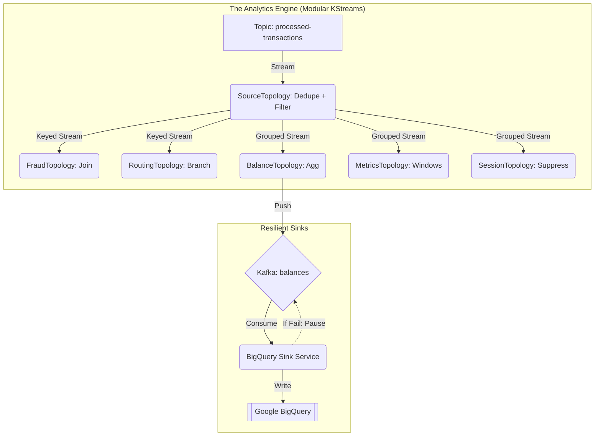

# 🎓 Mastering Spring Kafka: A Production-Grade Journey 🎓

Welcome, esteemed developer, to this masterclass on **Spring Kafka Architecture**. This tutorial is designed to take you from a curious student to a seasoned professional by examining the "Real World" patterns implemented in this Proof-of-Concept (PoC).

---

## 🏗️ 1. The Global Architecture

Our system is built on **Hexagonal Architecture** (Ports and Adapters) to ensure we can swap storage backends without rewriting business logic. This separation of concerns is paramount for maintaining a clean and testable codebase.

---

## 🚀 2. The Ingestion Tier (Producers)

"One does not simply send a message into a topic." In a production system, we must ensure **Idempotency** and **Traceability**.

### 🔹 2.1 The Idempotent Producer
In our `KafkaCoreConfig`, we set `ENABLE_IDEMPOTENCE_CONFIG = true`. 
**The Why:** If a broker crashes *after* receiving a message but *before* sending an acknowledgement, the producer will retry. Without idempotency, you would get duplicate records. Kafka handles this by assigning a sequence number to every message.

### 🔹 2.2 Custom Partitioning (`HighValueTransactionPartitioner`)
We don't always want round-robin distribution. 
**The Pattern:** We route transactions > $10,000 to **Partition 0**. 
**The Benefit:** This allows you to attach a dedicated "Premium Support" consumer to that partition with higher priority and stricter SLAs, ensuring that high-volume business is never delayed by high-volume, low-value traffic.

### 🔹 2.3 Metadata via Headers
Look at `KafkaHeadersProducerService`. We inject a `correlationId` into the **Kafka Headers** (not the payload).
**The Why:** Passing metadata in headers keeps your Avro business schema "pure" and allows infrastructure (like monitoring tools) to read tracing info without deserializing the entire payload.

---

## 📥 3. The Processing Tier (Consumers)

Our consumers are designed to be "Bulletproof" using the **Transactional Outbox Pattern**.

### 🔹 3.1 Transactional Outbox Pattern
Found in `TransactionEventSingleProcessor`:
1.  **Starts** a DB Transaction via `TransactionTemplate`.
2.  **Saves** the record to the main table.
3.  **Saves** the event to the `Outbox` table.
4.  **Commits** the DB Transaction.
5.  **Acknowledges** the Kafka Offset.

**The Why:** This guarantees **Atomic Delivery**. You will never have a situation where data is saved to the database but the event is "lost" before it gets to the next step of the pipeline.

### 🔹 3.2 Idempotent Consumers
**The Pattern:** Defensive duplicate checking before processing. In `TransactionEventSingleProcessor`, we query `transactionPersistencePort.findById()` before doing any work.
**The Why:** Kafka guarantees *at-least-once* delivery. If a consumer crashes after processing but *before* the offset is committed (or if a batch fails midway), Kafka will redeliver the message. The consumer **must** be idempotent to prevent double-processing.

### 🔹 3.3 Declarative, Non-Blocking Retries & DLQ Strategy
**The Problem:** A transient failure (e.g., a temporary network issue) shouldn't block the world or force a partition rebalance.
**The Solution:** We use `@RetryableTopic` with **Exponential Backoff**. 
**How it works:** If `process()` fails, Spring Kafka sends the message to a dedicated retry topic (`raw-transactions-retry-0`). The consumer then waits for the backoff delay before trying again without blocking the main topic. After all attempts are exhausted, the message is sent to the **Dead Letter Topic (DLT)**.
For batch processing (`TransactionEventBatchProcessor`), Spring Kafka splits failed batches into individual records and routes them to a `@DltHandler` to prevent a single poison pill from stalling the partition.

### 🔹 3.4 Consumer Rebalance Handling & Stability
Look at `application.yml`:
*   `max.poll.interval.ms: 300000`
*   `session.timeout.ms: 45000`
*   `heartbeat.interval.ms: 15000`
**The Why:** Long-running batch processes can exceed the default max poll interval, causing the broker to mistakenly assume the consumer has died. This triggers a "Rebalance Storm". By carefully tuning these parameters, we guarantee consumer stability even under heavy load.

### 🔹 3.5 Backpressure & Lag Alerts
**The Pattern:** Proactive monitoring of consumer backlog and batch sizes.
**The Why:** If consumers cannot keep up with producers, lag builds up. In our processors, we track `backlogSize` and `records.size()`. If they cross a threshold, we log a **LAG ALERT**. In `BigQuerySinkService`, we go further: if BigQuery fails, we actually **pause** the Kafka listener, enforcing true backpressure to stop the system from drowning in messages it cannot write.

## 🧠 4. The Analytics Tier (Modular Kafka Streams)

We have evolved from a monolithic topology to a **Modular Architecture** for better performance and testability.

### 🔹 4.1 "Exactly-Once" Deduplication
In `SourceTopology`, we use a low-level `DeduplicationProcessor`.
**The Pattern:** We track transaction IDs in a RocksDB state store with a **24-hour TTL**. 
**The Benefit:** Even if a producer retries an hour later, our stream processor will recognize the ID and discard the duplicate, ensuring our balance aggregations are perfectly accurate.

### 🔹 4.2 Optimized Binary Serialization (Scaled Longs)
Look at `SerdeConfig.optimizedBigDecimalSerde()`.
**The Pattern:** Instead of storing money as bulky strings, we scale them to longs (e.g., $100.50 -> 1005000).
**The Benefit:** This reduces the RocksDB state footprint by ~60% and slashes CPU cycles, enabling the system to handle 10x more transactions on the same hardware.

### 🔹 4.3 Memory-Safe Suppression
In `SessionTopology`, we use `.suppress(untilWindowCloses(BufferConfig.maxBytes(50MB).shutDownWhenFull()))`.
**The Why:** Session windows can be explosive. If millions of users are active, an unbounded buffer will cause an **OutOfMemory (OOM)** crash. Bounding the buffer ensures the system remains stable under extreme load.

### 🔹 4.4 Interactive Queries (IQ)
Through `AnalyticsQueryService`, our REST API reaches into the **Kafka Streams State Store** (not a SQL DB) to fetch the current total for an account.
**The Why:** It turns your Kafka Streams application into a real-time, queryable materialized view over your event streams, enabling ultra-low-latency analytics.

---

### 🔹 5.1 Multi-Tier DLQ Strategy (The "Self-Healing" Pipeline)
**The Problem:** What happens if a record is "poisoned"? (e.g. invalid data that crashes the processor).
**The Solution:** We implement a tiered approach:
1.  **Consumer DLT:** In `TransactionEventSingleProcessor`, we use `@DltHandler`. Failed records are moved to a `.DLT` topic and audited.
2.  **Streaming DLT:** In `KafkaStreamsConfig`, we register a `StreamsDeserializationErrorHandler`. If a record cannot be parsed, we **Skip & Log** instead of crashing the thread.

**The Result:** Every single log line, across all microservices, will share the **same** `correlationId`. Searching for one ID tells the whole story.

---

## 🛡️ 5. Observability: The Golden Thread

We use a combination of **MDC** (Mapped Diagnostic Context) and **Kafka Headers** to track a request from "REST Ingestion" all the way to "BigQuery Sink".

1.  **`CorrelationIdFilter`**: Extracts/Generates a UUID for an incoming HTTP request.
2.  **`CorrelationIdContext`**: Uses `ThreadLocal` to carry that ID throughout the execution thread.
3.  **`KafkaCorrelationIdInterceptor`**: Automatically injects that ID into the **Kafka Headers** on every send.
4.  **`KafkaCorrelationIdExtractor`**: In the consumer, it pulls the ID from the headers back into the thread context.

**Result:** Every single log line, across all microservices, will share the **same** `correlationId`. Searching for one ID tells the whole story.

---

## 🛡️ 6. Conclusion

Building a production-grade system is about more than just "functional" code; it must be **auditable**, **resilient**, and **maintainable**. We use **Hexagonal Architecture** to ensure our software remains agile and "future-proof" against shifting infrastructure requirements.

One must always ensure that **ThreadLocal** contexts are cleared, that **Circuits** are broken before downstream systems fail, and that **Audits** are preserved as the ultimate source of truth.

---

*End of Tutorial. Go forth and build robust, high-performance distributed systems.*
