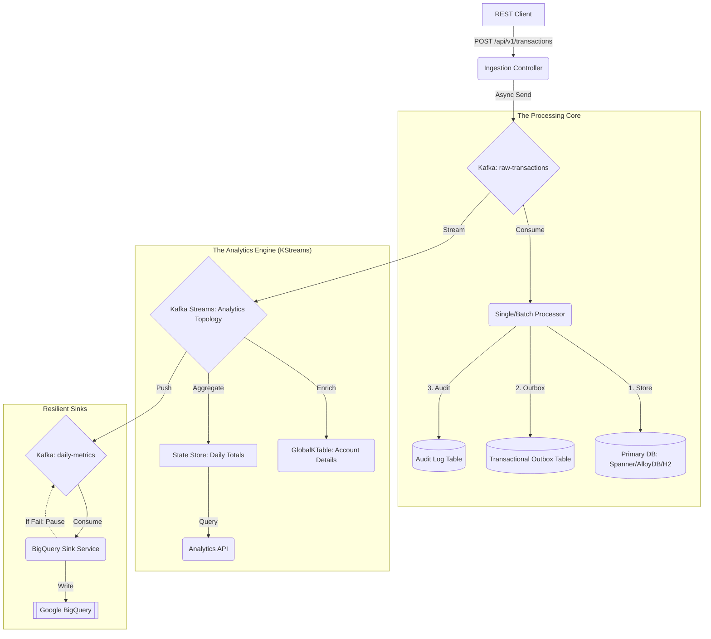

# 💂‍♂️ Mastering Spring Kafka: A Production-Grade Journey 💂‍♂️

Welcome, esteemed developer, to this masterclass on **Spring Kafka Architecture**. This tutorial is designed to take you from a curious student to a seasoned professional by examining the "Real World" patterns implemented in this Proof-of-Concept (PoC).

---

## 🏗️ 1. The Global Architecture

Our system is built on **Hexagonal Architecture** (Ports and Adapters) to ensure we can swap storage backends without rewriting business logic. This separation of concerns is paramount for maintaining a clean and testable codebase.

---

## 🚀 2. The Ingestion Tier (Producers)

"One does not simply send a message into a topic." In a production system, we must ensure **Idempotency** and **Traceability**.

### 🔹 2.1 The Idempotent Producer
In our `KafkaCoreConfig`, we set `ENABLE_IDEMPOTENCE_CONFIG = true`. 
**The Why:** If a broker crashes *after* receiving a message but *before* sending an acknowledgement, the producer will retry. Without idempotency, you would get duplicate records. Kafka handles this by assigning a sequence number to every message.

### 🔹 2.2 Custom Partitioning (`HighValueTransactionPartitioner`)
We don't always want round-robin distribution. 
**The Pattern:** We route transactions > $10,000 to **Partition 0**. 
**The Benefit:** This allows you to attach a dedicated "Premium Support" consumer to that partition with higher priority and stricter SLAs, ensuring that high-value business is never delayed by high-volume, low-value traffic.

### 🔹 2.3 Metadata via Headers
Look at `KafkaHeadersProducerService`. We inject a `correlationId` into the **Kafka Headers** (not the payload).
**The Why:** Passing metadata in headers keeps your Avro business schema "pure" and allows infrastructure (like monitoring tools) to read tracing info without deserializing the entire payload.

---

## 📥 3. The Processing Tier (Consumers)

Our consumers are designed to be "Bulletproof" using the **Transactional Outbox Pattern**.

### 🔹 3.1 Transactional Outbox Pattern
Found in `TransactionEventSingleProcessor`:
1.  **Starts** a DB Transaction via `TransactionTemplate`.
2.  **Saves** the record to the main table.
3.  **Saves** the event to the `Outbox` table.
4.  **Commits** the DB Transaction.
5.  **Acknowledges** the Kafka Offset.

**The Why:** This guarantees **Atomic Delivery**. You will never have a situation where data is saved to the database but the event is "lost" before it gets to the next step of the pipeline.

### 🔹 3.2 Declarative, Non-Blocking Retries (`@RetryableTopic`)
**The Problem:** A transient failure (e.g., a temporary network issue) shouldn't block the world.
**The Solution:** We use `@RetryableTopic` with **Exponential Backoff**. 
**How it works:** If `process()` fails, Spring Kafka sends the message to a dedicated retry topic (`raw-transactions-retry-0`). The consumer then waits for the backoff delay before trying again. After all attempts are exhausted, the message is sent to the **Dead Letter Topic (DLT)**.

---

## 🧠 4. The Analytics Tier (Kafka Streams)

Kafka Streams provides "Library-based stream processing," meaning it runs inside your Spring App process.

### 🔹 4.1 GlobalKTable Join
In `AnalyticsTopology`, we join the live Transaction Stream with an `accountTable` (GlobalKTable).
**The Pattern:** GlobalKTables are replicated to every node in your cluster. 
**The Benefit:** Joins are performed "Locally" (using an on-disk RocksDB store). There is **ZERO** network shuffle, making it incredibly fast and scalable.

### 🔹 4.2 Interactive Queries (IQ)
Through `AnalyticsQueryService`, our REST API reaches into the **Kafka Streams State Store** (not a SQL DB) to fetch the current total for an account. 
**The Why:** It turns your Kafka Streams application into a real-time, queryable materialized view over your event streams, enabling ultra-low-latency analytics.

---

## 🛡️ 5. Observability: The Golden Thread

We use a combination of **MDC** (Mapped Diagnostic Context) and **Kafka Headers** to track a request from "REST Ingestion" all the way to "BigQuery Sink".

1.  **`CorrelationIdFilter`**: Extracts/Generates a UUID for an incoming HTTP request.
2.  **`CorrelationIdContext`**: Uses `ThreadLocal` to carry that ID throughout the execution thread.
3.  **`KafkaCorrelationIdInterceptor`**: Automatically injects that ID into the **Kafka Headers** on every send.
4.  **`KafkaCorrelationIdExtractor`**: In the consumer, it pulls the ID from the headers back into the thread context.

**Result:** Every single log line, across all microservices, will share the **same** `correlationId`. Searching for one ID tells the whole story.

---

## 💂‍♂️ 6. A Note on "Queens English" & Professionalism

In the United Kingdom and across the Commonwealth, we value **robustness** and **precision**. A production system is not merely "functional"; it must be **auditable**, **resilient**, and **maintainable**. We use **Hexagonal Architecture** not for complexity's sake, but to ensure our software remains agile and "future-proof" against shifting infrastructure requirements.

One must always ensure that **ThreadLocal** contexts are cleared, that **Circuits** are broken before downstream systems fail, and that **Audits** are preserved as the ultimate source of truth.

---

*End of Tutorial. Go forth and build systems that would make a Victorian engineer proud.*
